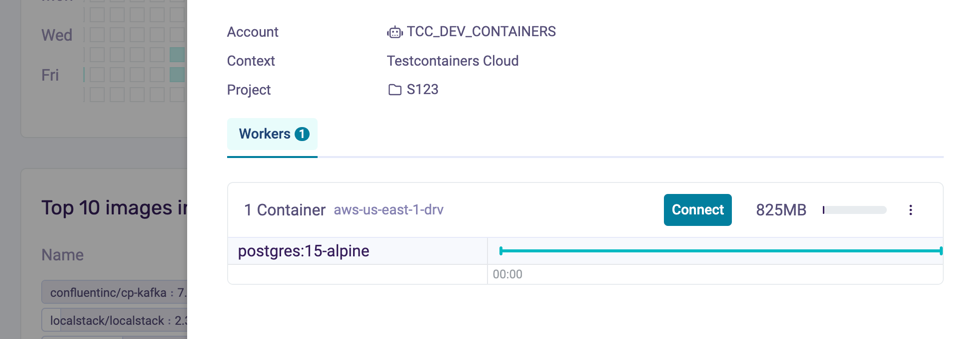
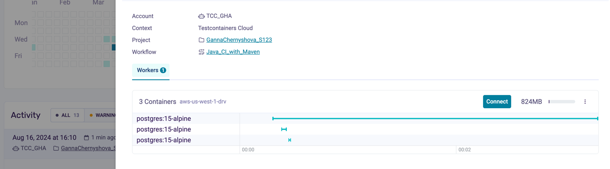

# Testcontainers Cloud demo application

1. Create a codespace workspace on the main 
2. To demo local development use case run application locally letting Spring Boot and Testcontainers set up a database for it: `./mvnw spring-boot:test-run`
3. Open the application in the browser: [link](http://localhost:8080/?http://localhost:8080/todos)
4. Enter `todos` in the Todo-Backend api root field, explore the UI
5. Open [Testcontainers Cloud dashboard](https://app.testcontainers.cloud/dashboard) and see the database instance created for the application
6. Highligt that you can tag Project (S123) and Account()
6. Connect to the cloud worker 
7. Do `docker ps` and see the database container running
* Optional: 
* get into postgers container `docker exec -it mypostgrescontainer sh` 
* login to postgres db`psql -h localhost -p 5432 -U test -d test`
* list tables `\dt`, or any other sql command
* `exit` container
8. Stop the application by `Ctr+C` in the terminal
9. Run appliaction tests by `./mvnw clean test`
10. Go to the [Testcontainers Cloud dashboard](https://app.testcontainers.cloud/dashboard) and containers started for the tests and then exited
11. Ask about Private registries and [show how to use them with Testcontainers Cloud](https://app.testcontainers.cloud/dashboard/settings)
12. Tell about Service accounts and how to [run Testcontainers test in CI with Testcontainers Cloud](https://www.testcontainers.cloud/ci)
13. Go to the latest GHA build, rerun the job, see CI build with proper Project, Workflow and Service account 
12. [Testcontainers Cloud pricing](https://www.testcontainers.cloud/pricing)

